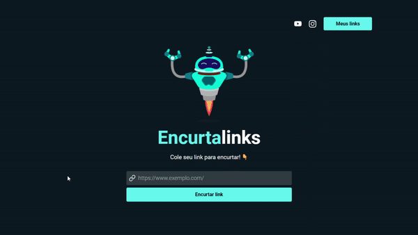

# 🔗 Encurtalinks 🤖
💻 <em>Projeto desenvolvido durante a Semana React JS, realizada pelo <a href="https://www.instagram.com/sujeitoprogramador/" target="_blank">Sujeito Programador</a>.</em>

#### 🔗 Confira em: https://encurtalinks.vercel.app/
 

___

- 🐱‍💻 Encurtador de links que utiliza a Bitly API.
- 📘 O usuário pode encurtar links, além de gerenciar seus links encurtados na página "Meus links", com dados armazenados no localStorage do navegador.
- 🧰 Outras tecnologias utilizadas: React Icons, Lottie Animations, React Router DOM e AXIOS.
